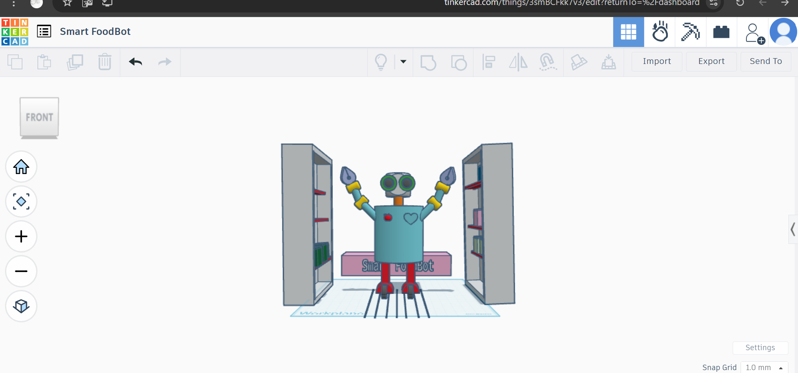
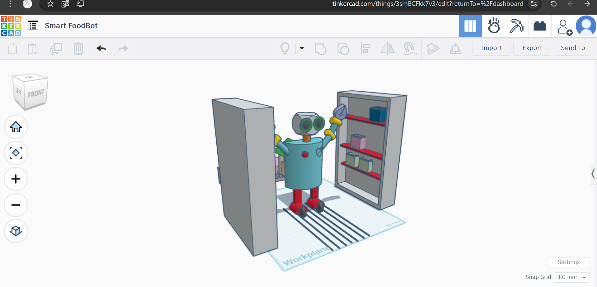
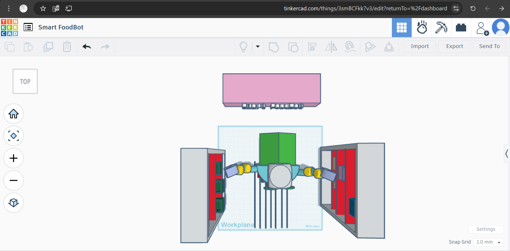
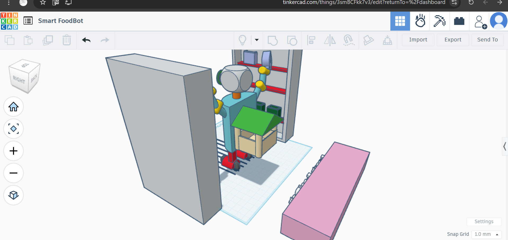
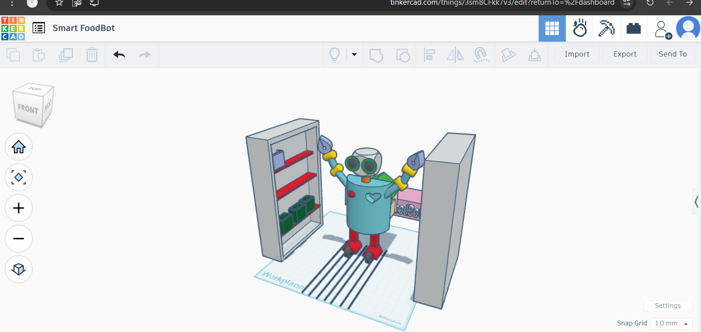

# 🦾 Smart FoodBot 🍎🤖

Design by: Abeer Alasmri  
Platform: Tinkercad  
Specialization: Mechanical Engineering  

---

## 💡 Project Idea  
Designing a smart autonomous robot to transform a food warehouse into a fully automated storage system with no human interaction. The robot moves through fixed paths and stores items in drawers and boxes efficiently.

---

## 🎯 Project Goals  
- Develop a robot capable of working in a warehouse environment independently.  
- Automate food storage and distribution tasks.  
- Reduce human involvement while increasing precision and efficiency.  
- Optimize space usage using an intelligent drawer system.  
- Use sensors (visual "eyes") for path detection and obstacle avoidance.

---

## 🧩 Components Description

| Part Name                   | Quantity | Description                            |
|-----------------------------|----------|----------------------------------------|
| Wheels                      | 4        | Movement of the robot                  |
| Drawers                     | 2        | Gray drawers for item storage          |
| Shelves                     | 6        | Red shelves for stacking items         |
| Basket with Cavity          | 1        | Back basket designed with a hole       |
| Eye Sensors                 | 2        | For path tracking and obstacle detection|
| Pathway lines for navigation| 7        | Ground Lines                           |
| Frame and Structure         | -        | Overall body of the robot              |

---

## 🛠 Tools Used in Tinkercad  
- Box  
- Cylinder  
- Hole tool  
- Workplane  
- Group/Ungroup  
- Align  
- Color adjustment  
- Mirror tool  

---

## 📸 Screenshots

| Screenshot Name      | Description                            |
|----------------------|--------------------------------------|
| Front_View.png       | Shows the front structure of the robot |
| Side_View.png        | Displays wheel alignment and drawer layout |
| Top_View.png         | Shows top view illustrating paths and ground lines |
| Back_View.png        | Shows the hollow rear basket and opening |
| Isometric_View.png   | Isometric angle showing the 3D design |

---

| Name                    | Image             |
|----------------------------|------------------|
| Front_View.png             | | 
 | Side_View.png     |   |
 | Top_View.png|           |
 | Back_View.png  |      |
 | Isometric_View.png | |

---

## 🔗 Project Link  
[Click to open the project in Tinkercad](https://www.tinkercad.com/things/3smBCFkk7v3)

---

## 🧠 What I Learned  
- How to design a 3D model of a smart robot using Tinkercad.
- Using design tools to create complex parts such as drawers and cutouts.
- Understanding the concept of robots in automated warehouses and how to represent them as models.
- Applying the idea of ground guiding lines (Working Envelope) to control the robot’s movement.
- Introducing the concept of sensors to improve movement accuracy and interaction with the environment.

---

## 📌 Task Requirements (from course)

Task:  
Build a smart port-robot to automate a food warehouse without human interference.

1. Algorithm of Execution:
   1. Activate the guiding system using ground lines (Working Envelope).
   2. Move the robot using wheels based on the predefined path.
   3. Use “eye” sensors to detect ground lines and obstacles.
   4. Use the arms to pick up food supplies from drawers or storage locations.
   5. Transfer the materials to the rear basket for collection.
   6. Return to the starting point or move to another location based on the task plan.
   7. Repeat the process automatically without human intervention.

2. Robot Design:
   - A solid central body with four wheels for smooth movement.
   - Two robotic arms with joints that allow gripping and lifting.
   - Two side drawers containing organized shelves for storing materials.
   - A hollow rear basket to receive transported items.
   - Ground lines to accurately define the movement path.
   - Front-facing sensors ("eyes") for detection and guidance.

3. Working Envelope Elements:
   - Movement Paths: Ground lines that define the route.
   - Arm Movement Range: The area reachable by the arms within the warehouse.
   - Robot Navigation Area: The space within which the robot can move without collisions.
   - Loading and Unloading Zones: Specific locations for the drawers and rear basket.
   - Sensor Coverage Area: The region scanned by the “eyes” to detect paths and obstacles.

---
